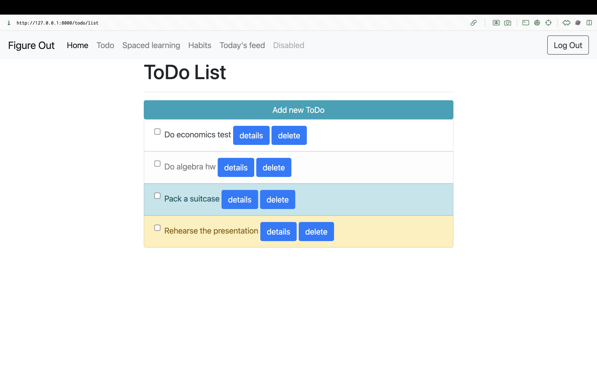
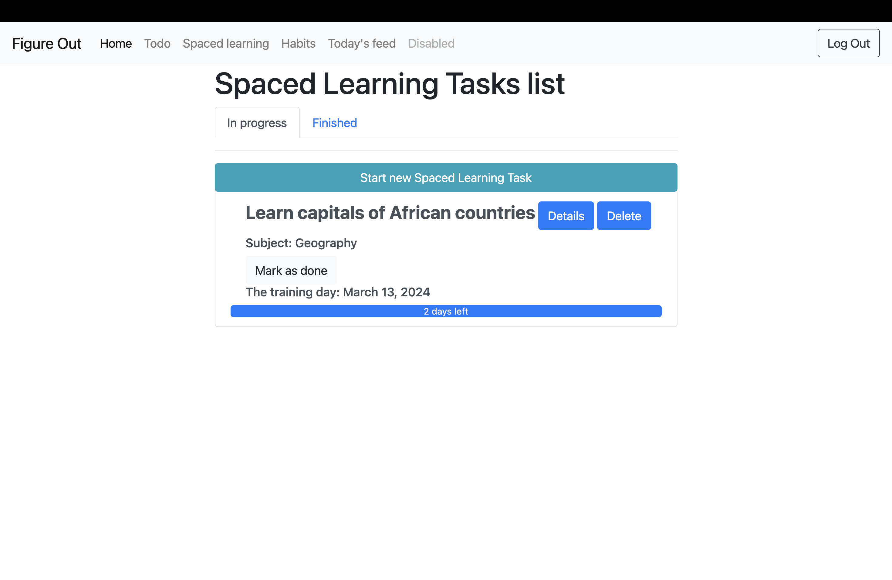
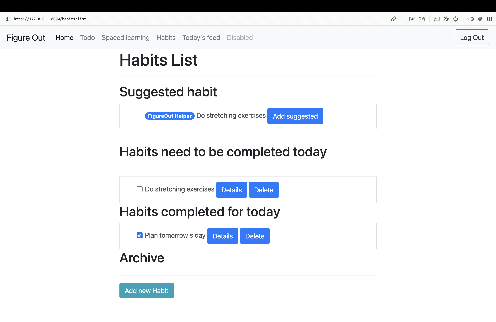
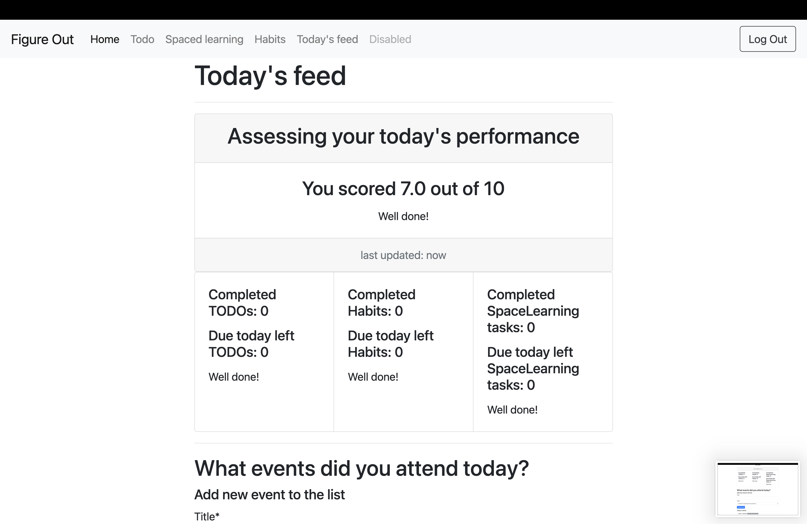

# Figure Out. Проект команды UNISPACE для научно-исследовательского семинара "Введение в облачные технологии"

В данном репозитории находится проект команды UNISPACE. Никакие наработки до начала реализации проекта не использовались.

## Содержание

- [Figure Out. Проект команды UNISPACE для научно-исследовательского семинара "Введение в облачные технологии"](#figure-out.-проект-команды-unispace-для-научно-исследовательского-семинара-"введение-в-облачные-технологии")
	- [Содержание](#содержание)
	- [Описание проекта](#описание-проекта)
	- [Инструменты](#инструменты)
		- [Список задач](#список-задач)
		- [Spaced learning](#spaced-learning)
		- [Трекер привычек](#трекер-привычек)
		- [Список-поток](#список-поток)
	- [Инструкция по эксплуатации](#инструкция-по-эксплуатации)
   		- [Сайт](#сайт)
   		- [Локально](#локально)
			- [Требования](#требования)
  				- [Bash](#bash)
  					- [Используя Docker](#используя-docker)
					- [не используя Docker](#не-используя-docker)
	- [Архитектура](#архитектура)
        - [Варианты испольщования](#варианты-использования)
        - [Архитектура в целом](#архитектура-в-целом)
        - [Паттерны и референсная архитектура](#паттерны-и-референсная-архитектура)
            - [Референсные архитектуры](#референсные-архитектуры)
            - [Референсные паттерны](#референсные-паттерны)

	- [Закулисные алгоритмы](#закулисные-алгоритмы)
		- [Предложение новых привычек](#предложение-новых-привычек)
		- [Расчет временных блоков для Spaced learning](#расчет-временных-блоков-для-spaced-learning)
		- [Расчет веса задачи](#расчет-веса-задачи)
			- [Вычисление очков пользователя](#вычисление-очков-пользователя)
			- [Финальный подсчет входной оценки пользователя](#финальный-подсчет-входной-оценки-пользователя)
		- [Оценка дня пользователя](#оценка-дня-пользователя)
	- [Структура модуля с алгоритмами](#структура-модуля-с-алгоритмами)
	- [Figma](#figma)

## Описание проекта
Figure Out - расширенный таск-менеджер. Он нужен, чтобы помочь человеку, [прежде всего студенту](https://thrivemyway.com/procrastination-statss/) избавиться от прокрастинации. Именно она мешает людям реализовываться, из-за нее мы теряем время, которое могли бы потратить с пользой. 

Согласно [статье _**The New York Times**_](https://www.nytimes.com/2017/07/21/science/procrastination-research-conference.html) 20% людей откладывают свои дела каждый день и в разных сферах жизни. Что касается студентов, то исследования утверждают, что от 80 до 95 процентов студентов прокрастинируют. Создавая наше приложение, мы во многом ориентировались именно на них. Также проект был вдохновлен книгой Петра Людвига _"Победи прокрастинацию!"_.

## Инструменты

### Список-задач

Сюда нужно записывать все свои дела, чтобы не забыть ни о каком. Список задач помогает выполнять дела в срок. Кроме того, записав задачу, можно выкинуть ее из головы и избавиться от ненужного стресса, который может  привести к выгоранию, из-за постоянного держания в уме дел.



### Spaced learning

Этот инструмент помогает выучить какой-либо материал. **Как он работает?** Предположим, вам нужно запомнить столицы европейских государств. Выучив их первый раз, через несколько дней они подзабудуться. А этот инструмент укажет, через сколько времени нужно будет еще раз повторить материал. Так, за несколько подходов получиться выучить все и не забывать, потратив оптимальное количество времени!



### Трекер привычек

Ключевой инструмент для построения самодисциплины. Тренирует силу воли и способность подчиняться собственным указаниям. Он прост в использовании, а регулярность способствует большей организованности и меньшей забывчивости.



### Список-поток 

Этот инструмент основан на исследовании Мартина Селигмана. Фундаментом метода служит ежедневное фиксирование трех позитивных событий. Список-поток помогает систематически ориентироваться на позитивное прошлое, что в долгосрочной перспективе увеличивает удовлетворенность жизнью. <br>
Однако, мы решили немного изменить этот инструмент. Мы сами оцениваем то, насколько пользователь был продуктивен в течении дня. Наш [алгоритм](#оценка-дня-пользователя) вычисляет эту оценку по нескольким критериям. Чем эффективнее был труд пользователя - тем больше баллов он наберет.


## Инструкция по эксплуатации

### Сайт

Для использования приложения необходимо перейти на сайт 51.250.114.113

### Локально

#### Требования

- Visual Studio Code
- Python 3.9+

##### Bash

`cd figure-out`  
`code .`

###### Используя [Docker](https://docs.docker.com/get-docker/)

Запускаем Docker. <br>
`cd docker`
`docker compose up --build -d`.

###### Не используя [Docker](https://docs.docker.com/get-docker/)

`source env/bin/activate` 
> Удостоверьтесь в том, что вы **всегда** работаете в виртуальном окружении.
Проверьте наличие `(env) ->` войдите в bash/zsh в текущей директории.
*Например*: `(env) -> figure-out git:(main) $` 

**Запускаем виртуальный сервер**
`python web/manage.py runserver` - стандартный порт 8080 <br>

## Архитектура

### Варианты использования

Для демонстрации вариантов использования приложения было принято решение создать [UML Use Case Diagram](https://en.wikipedia.org/wiki/Use_case_diagram), то есть диаграмму, описывающую функционал программной системы, доступный пользователю.


### Архитектура в целом


**Шаг 1:** Пользователь обращается на веб-сервер `nginx`, который позволяет обработать запросы от бОльшего количества пользователей за счет своей асинхронной архитектуры (все запросы обрабатываются на разных этапах, что повышает скорость обработки).

**Шаг 2:** Запрос попадает в связку Gunicorn + Django, где Gunicorn ответчает за управление набором рабочих процессов - воркеров. Главный процесс только распределяет запросы от клиентов сайта, а обрабатывают их воркеры.

**Шаг 3:** Django посылает Create, Read, Update, Delete (**CRUD**) запросы, которые посылаются в контейнер с PostgreSQL базой данных

**Шаг 4:** Django посылает запрос на получение различных ответов от модели машинного обучения с помощью **API** запросов

### Паттерны и референсная архитектура

В рамках работы над прототипом были учтены лучшие практики построения подобных решений. В качестве главного архитектурного принципа были выбрана несколько:

- Необходимость отделить бизнес логику веб сервиса от ресурсоемких задач Машинного Обучения
- Разделение данных приложения и управляющей логики на три отдельных компонента: модель, представление и контроллер — таким образом, что модификация каждого компонента может осуществляться независимо.

В этой связи мы опираемся на референсные архитектуры ведущих ИТ компаний, а также используем общеприщнанные паттерны, проверенные временем.

#### Референсные архитектуры

В качестве референсных архитектур мы взяли общепринятый подход [**MVC (Model, View, Controller)**](https://www.ibm.com/docs/en/radfws/9.6.1?topic=cycle-model-view-controller-architecture), а точнее его разновидность MVT (Model, View, Template). Таким образом, слой `Model` отвечает за представление моделей базы данных для работы `ORM` и практически всю бизнес-логику; слой `Template` отвечает за рендеринг веб-интерфейса, с когорым взаимодействует пользователь, а слой `View` - связывающий объект между Model и Template.

#### Референсные паттерны

Что касается паттернов, мы использем общепринятые подходы построения Django приложения и [GoF паттерны](https://subscription.packtpub.com/book/programming/9781788831345/1/ch01lvl1sec13/what-is-a-pattern) (насколько это возможно сделать внутри Django приложения):

- разделение проекта на независимые приложения, так называемые **Microservices Design Patterns**
- **Command pattern** (HttpRequest) - This encapsulates a request in an object
- **Observer pattern** (Django Signals) - When one object changes state, all its listeners are notified and updated automatically
- **Template method** (Class-based generic views) - Steps of an algorithm can be redefined by subclassing without changing the algorithm's structure

## Закулисные алгоритмы

### Предложение новых привычек

Каждый день приложение делает персонализированные предложения, которые зависят от:
- Возраста.
- Актуальных привычек.
- Предыдущих предложений.

Каждое предложение состоит из:
- Действия. Лаконичное описание, напрявляющее пользователя к физическому или эмоциональному благополучию.
- Цели. Ежедневная задача, например количество повторений или время выполнения привычки

Пользователи могут усовершенствовать предложения согласно их предпочтениям перед добавлением новой привычки.

Мы использовали ChatGPT, чтобы сгенерировать предложения привычек. А после программа, написанная на C#, отмечает документ и фильтрует привычки. Ниже приведен пример одной из них, направленной на поощрение пользователей за 5 перерывов во время работы для разминки.

```
{
    "id": 1,
    "name": "Делать периодические перерывы и выполнять короткую разминку",
    "type": "q", //quantity
    "value": 5, // 5 breaks
    "fixing": "bfu-kol" // fixes the bad habit (marked with id 'bfu-kol')
}
```

### Расчет временных блоков для Spaced learning

Процесс определения временных блоков для Spaced learning разделен на 2 категории:

**1. Первоначальное назначение**:
- Оценка сложности задания.
- Расчет подготовленности пользователя к деятельности.
- Оценивание прогресса спустя время.

**2. Корректировки**:
- Получение обратной связи от пользователя относительно опыта обучения.
- Регулировка скорости обучения (повторение, увеличение или уменьшение длительности последующих блоков).


#### Расчет веса задачи
Мы использовали программу на языке C# чтобы собрать информацию от друзей и коллег. Процесс включал сбор задач с их подробным описанием. Каждый участник также оценивал сложность своей задачи а затем упорядочивал их согласно этому параметру.


10 человек использовали эту программу. В результате в базе данных хранятся 120 задач. После чего, данные были обработаны программной на языке C# и записаны в CSV файл. Мы использовали библиотеку TensorFlow и алгоритм стандартной линейной регрессии, чтобы натренировать модель для оценки веса задачи. Функция потерь: 0.0931

#### Вычисление очков пользователя
На этапе регистрации пользователей встречает тест, оценивающий их способности эффективно учиться. Он служит первоначальной оценкой для адаптации опыта пользователя в приложении.

Результаты теста разбиты по категориям:
- Набор навыков
- Упорство и уверенность в себе
- Вредные образцы поведения
- Проблемы ментального здоровья


Эти данные используются для определения начальной оценки пользователя. ChatGPT сгенерировала широкий спектр ответов, которые впоследствии были оценены с использованием формулы.
```
var score = (3 - (double)data.SelectedOption) / 3 *
                    Math.Abs(0.25 * data.SkillsSet - 0.25 * data.BadQualities + 0.58 * data.UniqueGood);
        
```

Эти ответы подверглись дальнейшему уточнению и корректировке коллегами путем сравнения.
Затем мы опять использовали модель линейной регрессии для оценки новых пользователей с учетом их предпочтений. В результате получается количественный показатель, называемый оценкой пользователя. Он представлен действительным числом на интервале от 0 до 2. <br>
Функция потерь: 0.1531

#### Финальный подсчет входной оценки пользователя
Чтобы посчитать входную оценку пользователя, мы разработали алгоритм, вдохновленный алгоритмом Anki, дополненный данными от ChatGPT и одобренными 5 людьми. Этот алгоритм считает оценку, используя формулу, которая в последствии улучшается программой на языке C#. Выходные данные включают в себя 150 примеров, нацеленных на тренировку модели линейной регрессии для расчета входной оценки, представленной вещественным на интервале от 1.4 до 3.5. <br>
Функция потерь: 0.1278

Предоставленная функция вычисляет интервалы на основе выбранной скорости и дополнительного параметра task_weight. Эти интервалы определяют время для последующих повторений в spaced learning.
```
void GetIntervals(double rate, double weight, out List<int> days)
{
    var cutNumber = 60;
    // Exceed level of the right border.
    var exceedLevel = 1 + weight; 
    days = new();
    // First repetition - same day
    days.Add(1);
    for (int i = 0; i < 10; ++i)
    {
        if (days[i] >= cutNumber) break;
        days.Add((int)Math.Ceiling(Math.Min(days[i] * rate, cutNumber * exceedLevel)));
    }
}
```
Процесс генерации оценки включает в себя усреднение результатов тестов, которые геометрически преобразуются в плоскость. Супервайзер, наблюдавший за сопоставлением данных, отвечал за выбор подходящих результатов тестирования для случаев с различными стратегиями, обеспечивая точность и последовательность в процессе составления оценки.
```
var rate = GetZ1(data.Task, data.Score) + GetZ2(data.Task, data.Score) + GetZ3(data.Task, data.Score) + ....
rate /= 5;
// GetZi(x, y) -> z
```

### Оценка дня пользователя

Для дополнительного стимулирования продуктиновной работы, мы даем оценку дня пользователя. Формула, по которой считается эта оценка включается в себя такие факторы, как привычки, задачи, события, произошедшие за день и обучение по системе spaced learning.

```
var grade = (double)data.Habits / 2 + (double)data.Tasks / 2 + 
(double)data.Todos / 5 + (double)data.CntEvents / 5 + data.Reviewed;  
grade *= 2;  
grade *= 0.7;  
switch (data.Missed)    
{  
    case 0:  
        grade += 3;  
        break;    
    case <= 2:   
        grade += 1;  
        break;   
    case <= 4:   
        grade += 0.5;   
        break;   
}  
```
Однако после анализа и улучшения данных с использованием программы на С# и ChatGPT, оказалось, что не все случаи подходят под линейную формулу. Поэтому в формулу были внесены изменения, основанные на сравнении данных. Сейчас 40% оценки дня определяется с использованием модели линейной регрессии, которая опказывается, что в основном на увеличение оценки влияют задачи и привычки. В то время как упущенные события снижают ее. <br>
Функция потерь: 0.1313

## Структура модуля с алгоритмами
Структура модуля с алгоритмами состоит из отдельного модуля, направленного на улучшение вычислений. Он взаимодействует с API сервера, предоставляя доступ к данным для основного Django модуля с использованием REST API.

Ниже приведен отрывок кода, иллюстрирующего взаимодействие с тестирующей системой:
```
params = {
    "count_task": 10,
    "count_todos": 5,
    "count_habits": 4,
    "missed_events": 0,
    "events": [1],
    "reviewed": True,
}

response = requests.get(url + "/get_grade", params=params, timeout=10)
// {"result": "9.838282"}
```
Вы можете исполнять этот отрывок кода для тестирования отдельного подключения к API сервера. Эта архитектура обеспечивает бесшовную коммуникацию между модулем вычислений и основным модулем Django, обеспечивая эффективный обмен данными и функциональность системы.

## Figma
Изначально мы создали дизайн нашего приложения в [Figm'e](https://www.figma.com/file/xH2t47fpe25bJOsvKhqL8A/Figure-Out-(HSE)?type=design&node-id=0-1&mode=design&t=gbv71f2BmF91ir2Y-0), однако реализовать его было слшиком затруднительно из-за не совсем корректного импорта шаблонов страниц с помощью встроенных средств. В следствие чего было решено использовать [Bootstrap](https://getbootstrap.com/) для создания макета приложения.
